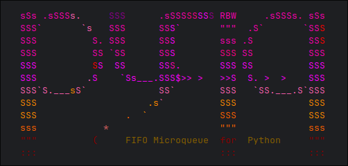

<p align="center">
  
</p>

---
`pyfiq` is a lightweight, MIT-licensed, Redis-backed FIFO task queue for Python. It lets you decorate functions with `@pyfiq.fifo(...)`, enqueue them for execution, and ensures those functions run **in strict order**, even across multiple application instances.  

You can think of `pyfiq` as an **embedded, Python-native alternative to AWS Lambda + SQS FIFO**: no external infrastructure, no vendor lock-in--just drop it into your app.

---

### Why pyfiq?  

- **Strict ordering**: tasks on the same queue are always executed in the order they were enqueued.  
- **Portable**: runs anywhere Python and Redis are available.  
- **Embedded**: workers run inside your application process--no external workers needed.  
- **Distributed**: automatically scales across multiple app instances, providing redundancy and load balancing.  
- **Parallel where it matters**: one worker per queue, multiple queues can be processed concurrently.  
- **Lightweight and scalable**: ideal for both small apps and large distributed backends.  
- **Non-breaking API**: decorate any function with `@pyfiq.fifo(...)` and call it as usual, queued transparently.  
- **Zero-config**: no brokers, orchestrators, or external services required.  

Decorated functions behave like normal Python functions, but instead of executing immediately, they’re placed into a FIFO queue for asynchronous processing by background workers.  

pyfiq is designed for workflows where **ordering matters more than raw throughput**, such as event-driven, state-changing operations.

---

### When does pyfiq make sense?  

In Python, offloading CPU-bound work to external systems (like Celery) is often necessary because of the Global Interpreter Lock (GIL). But for I/O-bound workloads, the story is different:  
- the GIL isn't a bottleneck.  
- asyncio or multithreading often provide great concurrency.

So why use a queue at all for I/O tasks?  

Because some workloads require **more than just concurrency**:  

- In distributed deployments, **concurrent requests** from multiple app instances can apply changes **out of order**, causing inconsistent state downstream.
- **Directly calling external systems** ties up app threads and pushes upstream errors down to clients
- **Traffic spikes** can flood external APIs and trigger rate limits, leading to outages.  

## Project status

This project is in its early stages of development.

## Usage

### Installing

`pyfiq` is already published on PyPI, but not yet included in deployment pipelines. For now, install directly from the Git master branch to try it out:

```bash
$ pip install git+https://github.com/rbw/pyfiq.git
```

---

### Start the worker

Start a background worker once at application startup, typically in your main thread or service entrypoint:

```python
from pyfiq import threaded_worker, RedisQueueBackend

# Start a threaded worker that processes queued tasks
threaded_worker(
    backend=RedisQueueBackend("redis://localhost")
)
```

This spins up a lightweight background thread that consumes tasks (i.e., functions decorated with `@pyfiq.fifo`) from Redis.


### Decorate your functions

Mark any function you want to run asynchronously and in strict FIFO order:

```python
import logging
import requests
import pyfiq

log = logging.getLogger(__name__)

def handle_success(retval, task, binding):
    log.info(f"Task succeeded ({task}): {retval}")


@pyfiq.fifo(queue="http-requests", on_success=handle_success)
def fetch_google():
    return requests.get("https://google.com")
```

### Call functions as usual

There’s no need to manage queues or start consumers manually. Simply call your decorated function:

```python
fetch_google()
```

Instead of running immediately, the call is enqueued for background execution in the order it was made.


---

## 📖 Examples

See [extra/examples](./extra/examples) for ready-to-run code samples.  
