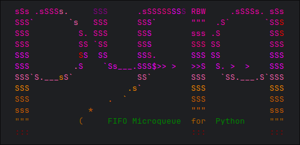

  

---

`pyfiq` is a lightweight, Redis-backed FIFO task queue for Python. It lets you decorate functions with `@fifo(...)`, enqueue them for execution, and ensures they run **in strict order**, even across multiple application instances.  

Decorated functions can be called like any normal Python function, but instead of executing immediately, they're placed into a FIFO queue for asynchronous processing by background workers.  

It's designed for workflows where **ordering matters more than raw throughput** -- for example:  

- Coordinating a sequence of state-changing operations (reserve -> commit -> release).  
- Propagating updates to a shared resource where operations must be applied in order.  
- Driving event chains where later steps depend on earlier ones completing.  

Unlike Celery, AWS Lambda and such, `pyfiq` runs **inside your application**, scales naturally with it, and requires no extra infrastructure or deployment. Think of it as a **"FIFO microqueue"**: minimal setup, zero external workers, and fully embedded.  

---

## Why pyfiq?  

- **Strict ordering**: tasks on the same queue are always executed in the order they were enqueued.  
- **Embedded and distributed**: workers live in your app and scale out naturally across multiple instances.  
- **Decorators feel native**: call `@fifo`-decorated functions like any normal Python function; they’re automatically queued behind the scenes.  
- **Lightweight and scalable**: works for both small apps and large distributed backends.  
- **Zero-config**: drop it in and go--no orchestration needed.  

---

## Why queue network I/O?  

In modern applications, network operations like API calls or event propagation can become a bottleneck:  

- Calling external systems directly ties up request/response cycles and risks failures bubbling up to clients.  
- Spikes in traffic can overwhelm external APIs and hit rate limits.  
- In distributed systems, concurrent calls from multiple instances can apply changes **out of order**  

By offloading network calls to a queue:  
- You decouple them from user-facing workflows.  
- You smooth out traffic bursts with natural throttling.  
- You enforce strict ordering, even across a scaled-out deployment.  

---

## 📖 Examples

See [the examples folder](./extra/examples) for ready-to-run code samples.  

---

## When *not* to use pyfiq  

This is **not Celery**. Don’t use it for:  

- CPU-bound workloads where parallelism matters.  
- High-throughput data processing.  
- Complex workflows needing robust monitoring, retries, and visibility.  
